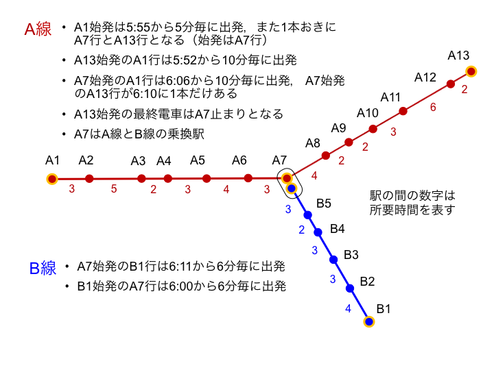

# [中級問題] いろは市鉄道の乗換案内を作成せよ！



いろは市には路線Aと路線Bの二つの路線が走っています。都心はA7付近であり、A1, A13,B1は住宅地のあるターミナル駅です。  
この二つの路線A、Bの任意の2駅を結ぶ乗換案内のCLIアプリケーションを作成してください。


## 運行に関する条件
### 路線A
- A1始発は5:55から5分毎に出発，また1本おきにA7行とA13行となる（始発はA7行）
- A13始発のA1行は5:52から10分毎に出発
- A7始発のA1行は6:06から10分毎に出発， A7始発のA13行が6:10に1本だけある
- A13始発の最終電車はA7止まりとなる

### 路線B
- A7始発のB1行は6:11から6分毎に出発
- B1始発のA7行は6:00から6分毎に出発

## CLIアプリケーションについて
出発駅、到着駅と出発時刻を与えられて最速の乗換経路を示すコンソールアプリケーションを作成しなさい。

このアプリケーションでは引数として以下の3つが与えられます。

- 出発駅名(ex. A1, B3 ...)
- 到着駅名(ex. A1, B3 ...)
- 時刻。HH:MM形式(ex. 08:24)

出力の形式は「路線名 出発駅 出発時刻 到着(乗換)駅 到着時刻」を一行とし、最終到着駅までのすべての電車を出力します。

```
$ myApp A1 B5 08:00
A A1 08:01 A7 09:13
B A7 09:17 B5 10:11
```

※ 入力の引数が不正な場合や到達不可能な場合はエラーメッセージを表示して終了コード(-1)で終了するようにします。

指定の路線、駅、上下における時刻表を出力するコンソールアプリケーションを作成しなさい。
このアプリケーションでは引数として以下の4つが与えられます。

## ヒント
- CLIで指定された出発時刻と出発駅の電車の出発時刻が同じ場合はその電車に乗ることができます。
- 乗換駅で乗換に要する時間は1分です。
  - 乗換駅に10:45に到着した場合、10:46の電車には乗れますが10:45の電車には乗れません。
- A1から出発する電車は2本に1本はA7止まりなので、乗る電車によってはA8以降に一本ではいけません。
  - この場合は出発時刻がもっとも遅くなる経路が正解となります。
  - つまり、A線だけを使ってA13方面に行くのに、A7駅で乗り換えるのは不正解です。

## テストケース
与えられるテストケースはすべて[testcase2.md](test/testcase2.md)に記載されています。

## answer.md
[answer.md]に自分の実装内容について説明を記述してください。
